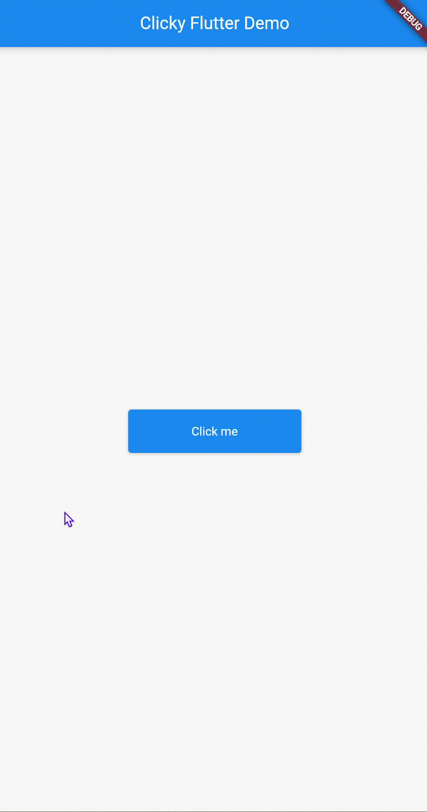

<!--
This README describes the package. If you publish this package to pub.dev,
this README's contents appear on the landing page for your package.

For information about how to write a good package README, see the guide for
[writing package pages](https://dart.dev/guides/libraries/writing-package-pages).

For general information about developing packages, see the Dart guide for
[creating packages](https://dart.dev/guides/libraries/create-library-packages)
and the Flutter guide for
[developing packages and plugins](https://flutter.dev/developing-packages).
-->

## clicky_flutter

<!-- put gif file named img/clickydemo.gif next to lib folder -->


<!-- ## Getting started -->

## Installation

Add the following to your `pubspec.yaml` file:

```yaml
dependencies:
  clicky_flutter: ^0.0.1
```

## Usage

To start using this package, import it into your code:

```dart
import 'package:clicky_flutter/clicky_flutter.dart';
```

Then one simple wrapper widget is all you need to start using the package, like this:

```dart
    Clicky(
        child: Container(
            child: ElevatedButton(
            onPressed: () {},
            child: Text('Go!'),
            ),
        )
    )
```
